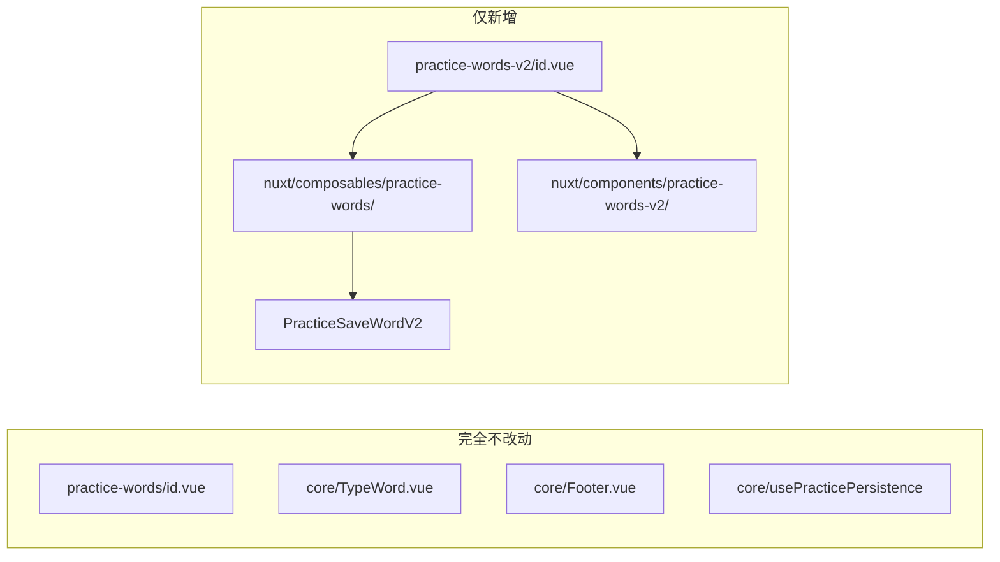
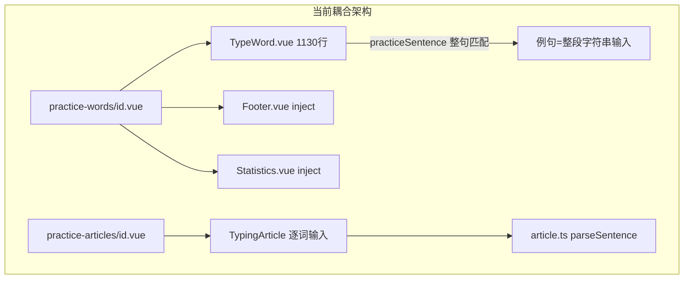
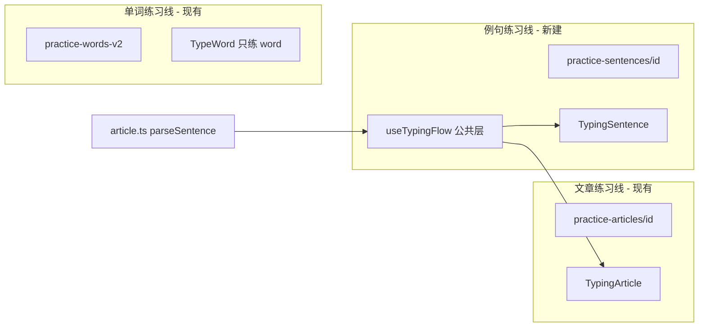
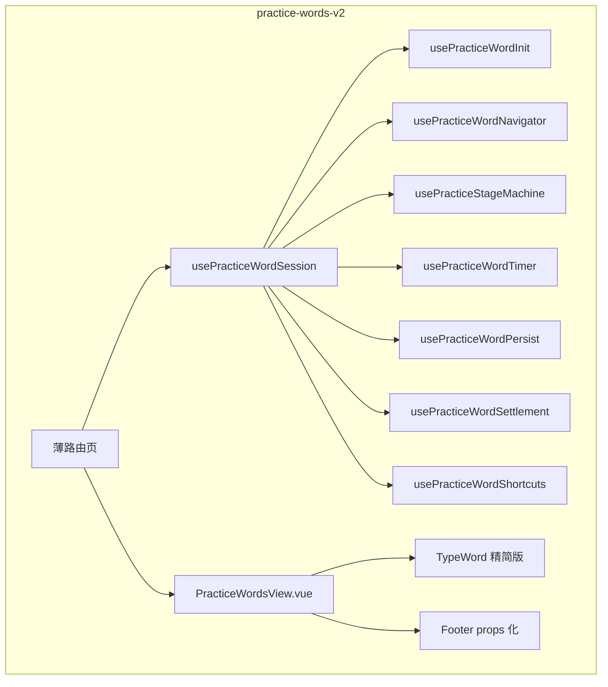
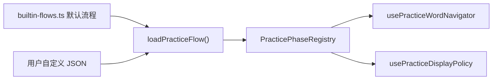
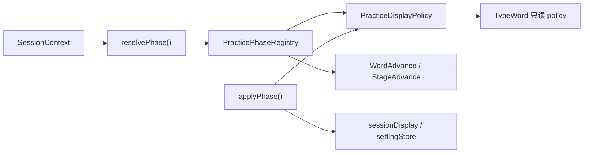
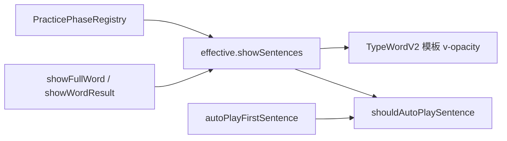
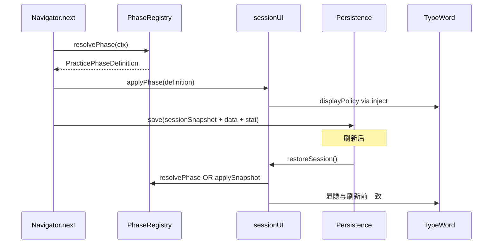

# 单词练习页 v2 重构计划

> **给 Agent 的执行说明**：执行前必读「〇、Agent 冷启动执行手册」与「零侵入原则」。严格按 Phase 1 → Phase 2 → Phase 2.5 → Phase 3 顺序；**禁止修改** v1 页面与 `packages/core` 现有练习文件。开发命令：在 `Typewords/` 目录执行 `pnpm -F @typewords/nuxt dev`，访问 `/practice-words-v2/{词典id}`；流程编排页 `/practice-flow-editor`（Phase 3）。

**范围**：`../apps/nuxt` 仅新增 v2 路由与副本代码

## 任务清单（进度可勾选）

- [x] Phase 1：复制骨架 + 独立缓存 `PracticeSaveWordV2`
- [x] Phase 2：Registry（可序列化）+ Navigator + sessionSnapshot + displayPolicy + keyboard
- [x] Phase 2 Architecture Upgrade：node/steps 三层模型 + Cursor 导航
- [ ] Phase 2.5：用户自定义流程 UI（档位 A，当前任务）
- [ ] Phase 3：用户自定义练习流程 UI（档位 A：阶段块拖拽编排）
- [ ] Phase 4：v2 组件拆分
- [ ] Phase 5–6：例句练习线（可选）
- [ ] Phase 7：合并 v1（远期，本次不做）

***

## 〇、Agent 冷启动执行手册（无聊天上下文时必读）

> 本节供**未参与前期讨论**的 Agent 直接执行。执行前通读本节 + 「零侵入原则」+ Phase 1→2；审计章节作背景参考，非首轮必改。

### 项目背景

- **仓库**：`Typewords/` monorepo，用户练习产品 [TypeWords](https://typewords.cc) 的网页端
- **子项目**：本次只动 `../apps/nuxt`（Nuxt 4 + Vue 3 + TS）
- **规范**：先读仓库根目录 [`AGENTS.md`](../AGENTS.md)；默认中文回复；样式用 UnoCSS
- **v1 源文件（只读对照，禁止修改）**：
  - 页面：[`apps/nuxt/app/pages/(words)/practice-words/[id].vue`](../apps/nuxt/app/pages/\(words\)/practice-words/\[id].vue)（\~1158 行）
  - 输入：[`packages/core/src/components/word/TypeWord.vue`](../packages/core/src/components/word/TypeWord.vue)（\~1130 行）
  - 底栏/结算：[`Footer.vue`](../packages/core/src/components/word/Footer.vue)、[`Statistics.vue`](../packages/core/src/components/word/Statistics.vue)
  - 配置：[`packages/core/src/config/env.ts`](../packages/core/src/config/env.ts)（`WordPracticeModeStageMap`）
  - 枚举：[`packages/core/src/types/enum.ts`](../packages/core/src/types/enum.ts)
  - 持久化参考：[`packages/core/src/composables/usePracticePersistence.ts`](../packages/core/src/composables/usePracticePersistence.ts)

### 目标（Goals）

| 优先级 | 目标                                                                                    |
| --- | ------------------------------------------------------------------------------------- |
| P0  | 新建 `/practice-words-v2/[id]`，**零修改** v1 与 core 现有练习文件                                 |
| P0  | `PracticePhaseRegistry` 可配置阶段流转，替代 v1 `next()`/`watchStage` 硬编码；内置默认流程 + 用户可自定义（档位 A） |
| P0  | 修复刷新后显隐错乱：`sessionSnapshot` + `applyPhase()` + 显隐二分                                   |
| P0  | `effective.showSentences` 统一 UI 显隐与例句自动播放条件                                           |
| P1  | Phase 3：可视化流程编排页，用户从预设阶段块拖拽排序、配置词源/shuffle/拼写子相位                                      |
| P1  | 去掉 v2 中 `__CURRENT_WORD_INFO__`，新建 `usePracticeWordKeyboard`                          |
| P1  | v2 内拆分 TypeWordV2，例句区只读（不在 v2 做例句输入）                                                  |
| P2  | Phase 5–6：例句独立练习 `/practice-sentences/[id]`（与 v2 单词页解耦）                               |

### 非目标（Non-Goals）— 本次不做

- 不修改 `/practice-words/[id]`、不修改 `packages/core` 下任何现有练习相关文件
- 不修改 [`words.vue`](../apps/nuxt/app/pages/\(words\)/words.vue) 导航（流程编辑器走独立路由 `/practice-flow-editor`）
- 不做全功能节点流程编辑器（档位 C：任意条件分支 / 自定义 wordLoop 规则）
- 不做档位 B（每阶段显隐微调 UI）— 留作二期可选
- 不替换正式路由、不删除 v1、不下沉 core（Phase 7）
- 不跑 `pnpm -F @typewords/nuxt build`（见 AGENTS.md）
- 不修改 `apps/vscode-web`（本轮仅 nuxt）

### 硬性约束（Constraints）

1. **复制再改**：凡 v1 有的组件/逻辑，在 `apps/nuxt/app/components/practice-words-v2/` 或 `apps/nuxt/app/composables/practice-words/` 新建副本
2. **独立缓存**：新 localStorage key `PracticeSaveWordV2`（**不要**复用 v1 的 `PracticeSaveWord` / `PRACTICE_WORD_CACHE`）
3. **显隐策略**：所有模式统一走 `sessionDisplay` + `displayOverride`；**禁止**用 settingStore.dictation / translate 字段做显隐
4. **例句自动播放**：`autoPlayFirstSentence && effective.showSentences`（与模板同一数据源）
5. **`groupSize = 7`**：跟写分组循环，从 v1 原样保留
6. **无用户明确要求不 git commit**

### 显隐 / 缓存 / 流转 — 已拍板决策（勿再争论）

```
阶段变化 / 缓存恢复 → resolvePhase() → applyPhase()
  └─ 所有模式统一：sessionDisplay 来自 Registry；用户 Toggle 只写 displayOverride；进下一阶段清空 override

刷新恢复：restoreSession() 唯一入口；snapshot 存 sessionDisplay + override，不存 dictation/translate
```

### 执行顺序（严格按 Phase，Phase 2 前勿大改架构）

```
Phase 1 → 复制页面+组件，抽 composables，v2 行为≈v1 副本，独立缓存
Phase 2 → 可序列化 Registry + Navigator + sessionSnapshot + displayPolicy + keyboard（✅ 完成）
Phase 2.5 → node/steps 三层模型 + Cursor 导航（当前）
Phase 3 → 用户自定义练习流程 UI（档位 A：阶段块拖拽编排）
Phase 4 → 仅改 v2 副本内组件拆分
Phase 5–6 → 例句线（可选，用户未要求时可暂停在 Phase 3/4）
```

### 关键新建文件清单（Phase 1–2.5 最低集）

```
apps/nuxt/app/pages/(words)/practice-words-v2/[id].vue
apps/nuxt/app/pages/(words)/practice-flow-editor.vue     # Phase 3
apps/nuxt/app/components/practice-words-v2/
  PracticeWordsView.vue
  TypeWordV2.vue          ← 复制自 core/TypeWord.vue
  FooterV2.vue
  StatisticsV2.vue
apps/nuxt/app/components/practice-flow/                  # Phase 2.5
  FlowEditor.vue
  PhaseBlockCard.vue
  FlowPreview.vue
apps/nuxt/app/composables/practice-words/
  usePracticeWordSession.ts
  usePracticeWordInit.ts
  usePracticeWordNavigator.ts
  usePracticeWordPersistenceV2.ts
  practice-phase-registry.ts   # 运行时入口 loadPracticeFlow()
  phase-templates.ts           # 阶段块模板
  builtin-flows.ts             # System/Review/... 默认流程
  flow-schema.ts               # 校验 + PracticeFlowConfig 类型
  usePracticeFlowStorage.ts    # 用户自定义流程持久化（独立 key）
  usePracticeDisplayPolicy.ts
  usePracticeWordKeyboard.ts
  usePracticeWordAudioV2.ts ← 复制自 core/composables/useWordPracticeAudio.ts
  types.ts
```

v2 页面 **禁止** import `@typewords/core/.../TypeWord.vue`（须用 `TypeWordV2.vue`）。\
**可以** import：`PracticeLayout`、`Panel`、`WordList`、`stores`、`types`、`utils` 等未改动的 core 模块。

### 开发验证

- 启动：在 `Typewords/` 目录执行 `pnpm -F @typewords/nuxt dev`
- 访问：`http://localhost:{port}/practice-words-v2/{词典id}`（从 `/words` 选词典后手动改 URL）
- 对比：同词典分别开 v1 / v2 标签页，**注意缓存 key 不同，进度不共享**
- Phase 2 验收：见下文「Phase 2 验收」清单，逐项手工测
- Phase 2.5 验收：见「三-C · Phase 2.5 验收」；流程编排页 `/practice-flow-editor`

### v1 行为对照表（Registry 填写依据）

实现 Registry 时，以 v1 [`next()`](../apps/nuxt/app/pages/\(words\)/practice-words/\[id].vue)（约 569–681 行）和 [`initData()`](../apps/nuxt/app/pages/\(words\)/practice-words/\[id].vue)（约 288–396 行）为**唯一行为真相**；重构后 v2 输出应与 v1 一致（除已修复的刷新显隐 bug）。

| Mode                                      | Stage 顺序（见 env `WordPracticeModeStageMap`） | 特殊                                 |
| ----------------------------------------- | ------------------------------------------ | ---------------------------------- |
| System                                    | 跟写新→听写新→默写新→自测旧→听写旧→默写旧                    | 跟写阶段内 `wordLoop` 7 词分组 + Spell 子相位 |
| Free                                      | 跟写新→Complete                               | 无 wordLoop；显隐用户控；错词 shuffle 重练     |
| Shuffle                                   | Shuffle→Complete                           | <br />                             |
| Review                                    | 自测旧→听写旧→默写旧                                | <br />                             |
| IdentifyOnly / DictationOnly / ListenOnly | 各 2 阶段                                     | <br />                             |
| 错词复习（跨 mode）                              | `isTypingWrongWord`                        | 强制 FollowWrite，shuffle wrongWords  |

### 已知 v1 Bug（v2 应修复，不要求 v1 改动）

- 缓存恢复不调 `watchStage`/`watchPracticeType` → 刷新后显隐与 stage 不一致（见三-B 问题 2）
- `canSeeSentences` 与模板 `v-opacity` 重复且与自由模式默写不同步（见例句自动播放专节）

### 计划内矛盾处（以零侵入为准）

- 二、例句专项中「Step 1 改 TypingArticle」→ **Phase 4 改为仅复制逻辑到 nuxt**，不改 core 原文
- Registry 注释写 `packages/core` → **v2 首轮放** **`apps/nuxt/app/composables/practice-words/`**

***

## 零侵入原则（本次硬性约束）

**明白，且作为最高优先级执行：**

1. **不修改任何现有 v1 代码**：包括 [`practice-words/[id].vue`](../apps/nuxt/app/pages/\(words\)/practice-words/\[id].vue)、[`packages/core`](../packages/core) 下所有现有组件/hooks/stores/composables。
2. **涉及的相关代码一律先复制再改**：在 nuxt 侧新建 `practice-words-v2` 目录，复制后重命名/重构，v2 路由**只引用副本**。
3. **新路由并行**：仅 [`/practice-words-v2/[id]`](../apps/nuxt/app/pages/\(words\)/practice-words-v2/\[id].vue)；原 `/practice-words/[id]` 保持可访问、行为不变。
4. **独立练习缓存**：v2 使用新 key（如 `PracticeSaveWordV2`），不与 v1 的 `PracticeSaveWord` 读写同一份数据，避免互相污染。
5. **不改正线入口**：不在 [`words.vue`](../apps/nuxt/app/pages/\(words\)/words.vue) 改导航；开发期手动访问 v2 URL 或另建 **新** dev 页。
6. **替换/合并回 core、删 v1** 属于远期 Phase 6，**本次重构范围内不做**。



### v2 目录规划（全部新建）

```
../apps/nuxt/
  app/pages/(words)/practice-words-v2/[id].vue     # 复制 [id].vue 后改
  app/pages/(words)/practice-flow-editor.vue       # Phase 2.5 流程编排
  app/components/practice-words-v2/
    PracticeWordsView.vue
    TypeWordV2.vue              # 复制自 core/TypeWord.vue
    FooterV2.vue                # 复制自 core/Footer.vue
    StatisticsV2.vue            # 复制自 core/Statistics.vue
    PracticeOnboardingHostV2.vue
    ...（按需复制 ConflictNotice 等）
  app/components/practice-flow/                    # Phase 2.5
    FlowEditor.vue
    PhaseBlockCard.vue
    FlowPreview.vue
  app/composables/practice-words/
    usePracticeWordSession.ts
    phase-templates.ts
    builtin-flows.ts
    practice-phase-registry.ts
    flow-schema.ts
    usePracticeFlowStorage.ts
    usePracticeWordPersistenceV2.ts   # 新 cache key
    ...
```

复制组件时 import 路径改为 v2 内部互相引用；**可继续 import** `@typewords/core` 里**未改动的**公共模块（stores、types、utils、PracticeLayout 等）。

***

核心链路涉及两个「上帝组件」：

| 文件                                                                                     | 行数     | 角色                 |
| -------------------------------------------------------------------------------------- | ------ | ------------------ |
| [`practice-words/[id].vue`](../apps/nuxt/app/pages/\(words\)/practice-words/\[id].vue) | \~1158 | 会话编排、状态机、持久化、结算    |
| [`TypeWord.vue`](../packages/core/src/components/word/TypeWord.vue)                    | \~1130 | 单词输入、例句输入、自测、笔记、收藏 |

对比参照：[`TypingArticle.vue`](../packages/core/src/components/article/TypingArticle.vue) \~1062 行（文章输入），[`words-test/[id].vue`](../apps/nuxt/app/pages/\(words\)/words-test/\[id].vue) \~187 行（干净反面教材）。



***

## 一、关联组件/逻辑审计（写得不好 / 冗余 / 有问题）

### A. 页面层 [`practice-words/[id].vue`](../apps/nuxt/app/pages/\(words\)/practice-words/\[id].vue)

**严重问题**

1. **`next()`** **隐式状态机**（\~110 行）：7 种 `WordPracticeMode` × 多 `WordPracticeStage` + 错词复习 + 跟写分组，与 [`WordPracticeModeStageMap`](../packages/core/src/config/env.ts) 配置重复但未复用。
2. **`initData()`** **与** **`onvisibilitychange`** **恢复逻辑重复**：taskWords / practiceData / statStore 三件套 patch 写了两遍。
3. **`runtimeStore.globalLoading`** **滥用作互斥锁**：save、fetch、complete、visibility 四处抢锁，易造成 UI 卡顿或丢保存（已有 todo 注释）。
4. **`Object.assign`** **workaround**：不能直接 `taskWords = xxx` 否则 inject 失效——说明 provide 设计有问题。
5. **`watchRefList`** **+** **`isIniting`** **惰性 watch**：HMR 补丁 + 缓存恢复时机 hack，不是正常生命周期管理。

**冗余 / 应移出**

1. Shepherd Tour、Umami 埋点、Conflict/Collect 弹窗 `setTimeout` 时序——与练习核心无关。
2. `if (import.meta.client) {}` 空块、多处 `console.log` 调试残留。
3. `getDefaultPracticeData` 用 `Object.assign(origin, ...)` 会 mutate 传入的 origin，易出隐蔽 bug。

**设计缺陷**

1. **`usePracticeStore`** **单词/文章共用**：[`practice.ts`](../packages/core/src/stores/practice.ts) 被单词页和 [`practice-articles`](../apps/nuxt/app/pages/\(articles\)/practice-articles/\[id].vue) 共用，切换练习类型时存在状态残留风险。
2. **错词处理逻辑三处重复**：`next()` 内、`onWordMarkPickComplete`、`WordMarkPickList` 完成回调，结构相同但复制粘贴。

***

### B. 输入组件 [`TypeWord.vue`](../packages/core/src/components/word/TypeWord.vue) — 第二个上帝组件

**严重问题**

1. **1130 行单文件承担 6+ 职责**：跟写/默写/听写/自测/单词测试、例句练习、笔记、收藏、发音、光标定位。
2. **`window.__CURRENT_WORD_INFO__`** **可移除（v2）**——见下文「空格键与全局变量」专节；v1 不改动。
3. **光标定位用** **`document.querySelector('.cursor')`** **/** **`.l`**：依赖 DOM class，与 Vue 组件边界冲突，多实例时会错位。
4. **例句练习实现方式错误**（见下文「例句专项」）：`practiceSentence` 模式下把整句 `sentence.c` 当作单一 target 逐字符匹配，与文章逐词输入体验不一致。

**冗余**

1. 例句列表 UI（990-1025 行）与输入逻辑缠在一起；跟写完成后 `currentPracticeSentenceIndex++` 从 -1 变 0 的隐式状态切换难懂。
2. `SENTENCE_PLAY_SHORTCUT_KEYS` 硬编码 9 个快捷键与 sentences 数组索引绑定。
3. `sentenceVolumeIconsRefs: any` 无类型。

**应拆分方向**

```
TypeWord.vue (1130行)
  → TypeWord.vue          (~200行 壳 + 布局)
  → WordTypingCore.vue    (共享 input/wrong/lock/键盘)
  → WordIdentifyPanel.vue (自测/WordTest)
  → WordMetaPanel.vue     (音标/例句展示/短语 — 只读，不承载输入)
  → 例句输入 → 迁出到 TypingSentence（独立功能）
```

***

### C. [`Footer.vue`](../packages/core/src/components/word/Footer.vue)（415 行）

1. **`inject('practiceData')`** **隐式依赖**：与页面 provide 强耦合，Footer 无法单独使用或测试。
2. **阶段进度条逻辑 \~150 行**：`stageMap`、magic number（49/70/30 ratio）与 `env.ts` 的 `WordPracticeStageNameMap` 再次重复；[`StageProgress.vue`](../packages/core/src/components/StageProgress.vue) 本应消化这部分。
3. **v2 目标**：Footer 改 props 传入 `{ stage, index, total, isTypingWrongWord }`，废弃 inject。

***

### D. [`Statistics.vue`](../packages/core/src/components/word/Statistics.vue)（291 行）

1. 同样 `inject('practiceData')`，仅用于展示错词数等——应改为 props。
2. 结算弹窗与 [`complete()`](../apps/nuxt/app/pages/\(words\)/practice-words/\[id].vue) 强耦合（`v-model="isComplete"`），结算数据准备应在 composable 完成，Statistics 只负责展示。

***

### E. 键盘事件层 [`event.ts`](../packages/core/src/hooks/event.ts)

1. **三层键盘处理叠加**：`useStartKeyboardEventListener`（全局）→ `emitter EventKey.onTyping` → `TypeWord.useOnKeyboardEventListener`（组件内 Backspace）。
2. **`__CURRENT_WORD_INFO__`** **在 v2 中删除**（分析见下）；v1 的 `event.ts` 不修改。
3. **v2 替代**：`usePracticeWordKeyboard.ts`（nuxt 新建），Space 统一规则，无需 window 全局变量。

#### 空格键与 `__CURRENT_WORD_INFO__`（结论：v2 可去掉）

**历史用途**（[`event.ts:314-328`](../packages/core/src/hooks/event.ts)）：在快捷键匹配**之前**，若满足以下任一条件则将 Space 提前转给 `onTyping`：

- 当前词含空格，且下一字符正是空格（如 `ice cream` 敲到词间空格）
- `inputLock === true`（输入完成，等空格切下一词）

**为何现在可以去掉**：同文件 **351-353 行** 已有兜底——快捷键未命中时，**所有 Space 一律** **`emitter.emit(EventKey.onTyping)`**。默认快捷键表（[`DefaultShortcutKeyMap`](../packages/core/src/config/env.ts)）**没有任何一项绑定裸 Space**，因此含空格词、`inputLock` 场景最终都会进 `TypeWord.onTyping`，前置的 `__CURRENT_WORD_INFO__` 判断与兜底**结果等价**。

**遗留问题（也支持删除）**：

| 问题                 | 说明                                                     |
| ------------------ | ------------------------------------------------------ |
| 冗余双路径              | 315-328 行与 351-353 行做同一件事，增加维护成本                       |
| 同步风险               | `updateCurrentWordInfo()` 需在多处手动调用，`inputLock` 可能短暂不同步 |
| 卸载不清理              | `TypeWord` `onUnmounted` 未清空全局对象，切到文章练习时可能残留脏数据        |
| `containsSpace` 字段 | 写入后从未被读取                                               |

**v2 键盘规则（写入** **`usePracticeWordKeyboard`）**：

```ts
// 练习页激活时：Space 始终优先走 onTyping，不参与快捷键匹配
if (e.code === 'Space' && practiceTypingActive) {
  e.preventDefault()
  return emitter.emit(EventKey.onTyping, e)
}
// 含空格词、inputLock、默写确认等细节 — 全部在 TypeWordV2.onTyping 内处理（已有）
```

- **删除**：`updateCurrentWordInfo()`、`window.__CURRENT_WORD_INFO__`、`global.d.ts` 声明（仅 v2 副本与 v2 composable，**不动** core/nuxt 原 global.d.ts 直至远期合并）
- **保留**：`TypeWordV2.onTyping` 内现有 Space 分支（`inputLock` 切词、默写确认、冷却时间等）——这些才是真正的业务逻辑

**验收**：`ice cream` 类含空格词可正常输入空格；输入完成后空格切下一词；用户自定义快捷键为 Space 时文档说明不与练习同页（边缘情况，与现网相同）。

***

### F. 弹窗 [`ConflictNotice`](../packages/core/src/components/dialog/ConflictNotice.vue) / [`ConflictNotice2`](../packages/core/src/components/dialog/ConflictNotice2.vue)

1. 两个组件 + [`ConflictNoticeText`](../packages/core/src/components/dialog/ConflictNoticeText.vue) 内容重复；一个 `v-if` 一个 `v-model`，页面里三个 boolean + 两个 `setTimeout` 控制显示。
2. **合并为** `PracticeOnboardingHost.vue`：统一「冲突提示 / 收藏提示 / Tour」的显示策略。

***

### G. [`WordMarkPickList.vue`](../packages/core/src/components/word/WordMarkPickList.vue)

1. 组件本身尚可（197 行），但页面 [`onWordMarkPickComplete`](../apps/nuxt/app/pages/\(words\)/practice-words/\[id].vue) 又写了一遍「不认识 → wrongWords → shuffle → next」——应内化到 navigator。

***

### H. 持久化 [`usePracticePersistence.ts`](../packages/core/src/composables/usePracticePersistence.ts)

1. 设计合理，但 **segments 时间片维护** 散落在页面 4 处——应收敛到 `usePracticeTimer` 单一模块。
2. 尚无 `PRACTICE_SENTENCE_CACHE`——例句独立功能需要新 cache key。

***

### I. 设置项 [`practiceSentence`](../packages/core/src/stores/setting.ts)

1. 当前是单词跟写后的「附加例句整句输入」开关，挂在 [`WordSetting.vue`](../packages/core/src/components/setting/WordSetting.vue)。
2. **长期应废弃**：例句练习独立后，此开关迁移到例句练习设置，单词练习 TypeWord 不再承载例句输入。

***

## 二、例句练习专项：问题与拆分方案

### 当前实现的问题

[`TypeWord.vue`](../packages/core/src/components/word/TypeWord.vue) 在 `settingStore.practiceSentence === true` 且跟写完成时：

```ts
// completeTypeWord 内：-1 → 0 → 1 ... 逐条例句
currentPracticeSentenceIndex++
// onTyping 内：整句作为单一 target
target = props.word.sentences[currentPracticeSentenceIndex].c
```

| 维度    | 单词例句模式（现）          | 文章输入（目标体验）                           |
| ----- | ------------------ | ------------------------------------ |
| 输入单元  | 整句字符串 `sentence.c` | `parseSentence` 分词后的 `ArticleWord[]` |
| 空格    | 句内普通字符             | 词间显式 `isSpace` + `nextSpace` 流程      |
| 标点/数字 | 全部要敲               | `ignoreSymbol` 可跳过                   |
| 光标    | 句内字符光标             | `TypingWord` 逐词高亮                    |
| 上下文   | 单词完成后在同一卡片敲例句      | 独立句子流                                |

**结论**：例句不是「长一点的单词」，输入模型应跟文章对齐，而不是塞进 TypeWord 的单词状态机。

### 目标：例句练习作为独立功能线



### 技术方案（推荐分三步）

#### Step 1 — 抽出公共输入引擎（**复制到 nuxt，不改 core**）

从 [`TypingArticle.vue`](../packages/core/src/components/article/TypingArticle.vue) **复制**逻辑到 nuxt：

```
apps/nuxt/app/composables/typing/   # Phase 4 新建，不修改 core
  useTypingFlow.ts
  types.ts
  # parseSentence 可从 @typewords/core/hooks/article 纯函数侧复制
```

**不修改** [`TypingArticle.vue`](../packages/core/src/components/article/TypingArticle.vue)。

#### Step 2 — 新建 `TypingSentence.vue`

单句版 TypingArticle：

- **输入**：`{ text: string, translate: string, sourceWord?: Word }`（来自 `word.sentences[i]`）
- **内部**：`parseSentence(text)` → 单 Section 单 Sentence 的迷你 Article
- **UI**：复用 `TypingWord` + `Space` + 句子级翻译展示
- **事件**：`@complete` `@wrong` `@play` 与文章一致

可选：高亮当前练习词（`sourceWord`）用现有 [`SentenceHightLightWord.vue`](../packages/core/src/components/word/SentenceHightLightWord.vue)。

#### Step 3 — 独立例句练习会话

```
apps/nuxt/app/pages/(words)/practice-sentences/[id].vue   # 新路由
apps/nuxt/app/composables/practice-sentences/
  usePracticeSentenceSession.ts
  usePracticeSentenceInit.ts      # 从词书收集例句列表
  usePracticeSentencePersist.ts   # 新 cache: PRACTICE_SENTENCE_CACHE
```

**会话模型**（与单词练习刻意不同）：

| 项目     | 单词练习                         | 例句练习                                            |
| ------ | ---------------------------- | ----------------------------------------------- |
| 练习单元   | `Word`                       | `SentenceItem { sentence, parentWord, dictId }` |
| 阶段机    | FSRS + 跟写/听写/默写/自测           | 简化：跟写句 / 听写句 / 默写句（或先只做一种）                      |
| 进度     | `lastLearnIndex` + taskWords | 独立 `sentenceProgress` 或按词书例句索引                  |
| 持久化    | `PRACTICE_WORD_CACHE`        | `PRACTICE_SENTENCE_CACHE`                       |
| 输入组件   | `TypeWord`                   | `TypingSentence`                                |
| 与 FSRS | 直接更新 word card               | 可选：错句关联回 `parentWord` 评级                        |

**例句来源策略**（init 时）：

1. 当前词书所有 `word.sentences` 展平为列表
2. 支持筛选：仅今日新词例句 / 全部 / 错词关联例句
3. 暂不复用 `taskWords.new/review` 结构——例句有自己的队列

**与单词练习的关系**：

- v2 单词页 **移除** `practiceSentence` 相关 UI 与 `TypeWord` 内例句输入分支
- 单词页例句区改为 **只读展示**（发音 + 翻译），可选加「去例句练习」跳转
- 设置里 `practiceSentence` 标记 deprecated，引导到例句练习入口

### 例句功能入口（后续产品层）

- [`words.vue`](../apps/nuxt/app/pages/\(words\)/words.vue) 增加「例句练习」按钮 → `/practice-sentences/:id`
- 单词练习面板 TypeWord 下方例句可点「单独练习此句」

***

## 三、单词练习 v2 目标架构（更新）



原则调整（更大胆，但 **零侵入**）：

- **原** **`/practice-words/[id]`** **及 core 相关文件：一行不改**
- **v2 一切在 nuxt 新目录**：页面、composables、复制的组件副本
- **TypeWord/Footer/Statistics**：复制为 `*V2.vue`，在副本内拆分重构
- **独立 v2 缓存 key**，与 v1 并行存储
- **验证期**：两路由手动对比；远期再谈替换 v1（本次不做）

### 文件规划（nuxt 层，均新建）

```
../apps/nuxt/
  app/pages/(words)/practice-words-v2/[id].vue
  app/pages/(words)/practice-sentences/[id].vue          # Phase 5，亦为新路由
  app/components/practice-words-v2/                      # 见「零侵入原则」
  app/composables/practice-words/
```

***

## 三-B、本次重点解决的三个问题（状态流转 / 缓存错乱 / 显隐混乱）

这是你提出的三个核心痛点，它们**其实是同一个根因的三张脸**：练习「当前处于什么阶段、该显示什么、下一步去哪」被拆散在 `next()`、`watchStage`、`watchPracticeType`、`TypeWord` 模板和全局 `settingStore` 五处，且缓存只存了其中一部分。

### 问题 1：状态流转硬编码 — 做成可配置

#### 现状

[`next()`](../apps/nuxt/app/pages/\(words\)/practice-words/\[id].vue) 末尾按 `wordPracticeMode × stage` 硬编码下一阶段；[`watchStage`](../apps/nuxt/app/pages/\(words\)/practice-words/\[id].vue) / [`watchPracticeType`](../apps/nuxt/app/pages/\(words\)/practice-words/\[id].vue) 再各自维护一份「阶段 → 练习类型 → dictation/translate」映射。`wordLoop` 又在同一 `stage` 内切换 `FollowWrite ↔ Spell`，形成**第四套隐式状态**。

#### 推荐设计：`PracticePhaseRegistry`（阶段注册表）

不用 XState，用**一张声明式注册表**统一描述「每个阶段是什么、显示什么、怎么导航」：

```ts
// apps/nuxt/app/composables/practice-words/practice-phase-registry.ts（v2 首轮放 nuxt，不下沉 core）

/** 一次练习「相位」的完整定义 — 阶段 + 子类型 + 特殊标记 的唯一解 */
interface PracticePhaseKey {
  mode: WordPracticeMode
  stage: WordPracticeStage
  practiceType: WordPracticeType   // 含 Spell 子相位
  isTypingWrongWord?: boolean
}

/** UI 显隐策略 — TypeWord 唯一数据源 */
interface PracticeDisplayPolicy {
  source: 'phase'
  wordMask: 'none' | 'underscore' | 'hidden'
  showPhonetic: boolean | 'shadow'
  showWordTranslation: boolean
  showSentences: boolean
  showSentenceTranslation: boolean
  showPhrases: boolean
  showEtymology: boolean
  showRelWords: boolean
  inputMode: 'typing' | 'dictation' | 'listen' | 'identify-self' | 'identify-test' | 'identify-quick'
  allowWordTip: boolean
  autoNextWord: boolean
}

/** 列表内导航 — 单个词完成时 */
interface WordAdvanceRule {
  type: 'increment' | 'wordLoop' | 'identify-complete'
  groupSize?: number                               // wordLoop 用
}

/** 列表走完 → 下一阶段 */
interface StageAdvanceRule {
  nextStage?: WordPracticeStage
  complete?: boolean                               // 整轮结束
  wordsFrom: 'taskNew' | 'taskReview' | 'wrongWords' | 'current'
  shuffle?: boolean
  toast?: string
  forcePracticeType?: WordPracticeType             // 错词复习进 FollowWrite
  forceWrongWordMode?: boolean
}

interface PracticePhaseDefinition {
  key: PracticePhaseKey
  display: PracticeDisplayPolicy
  wordAdvance: WordAdvanceRule
  stageAdvance: StageAdvanceRule
}
```

**解析相位**（唯一入口 `resolvePhase(ctx)`）：

```ts
function resolvePhase(ctx: SessionContext): PracticePhaseDefinition {
  // 1. 错词复习：按 mode 分流（Free 用 FREE_WRONG_REVIEW，其他用各 mode 的 wrongReview 定义）
  if (ctx.practiceData.isTypingWrongWord) {
    return REGISTRY[ctx.mode].wrongReview ?? REGISTRY.wrongWordReview
  }
  // 2. 同 stage 内 FollowWrite ↔ Spell 子相位（Free 无此分支）
  if (ctx.mode !== Free && ctx.stage === FollowWriteNewWord && ctx.practiceType === Spell) {
    return REGISTRY.system.spellInGroup
  }
  // 3. 查表：(mode, stage, practiceType)
  return REGISTRY[ctx.mode][ctx.stage]
}
```

#### Free 模式已完全退化为普通 flow 配置

`WordPracticeMode.Free` 在 v2 中**不再有任何特殊分支**。其行为差异全部通过 `builtin-flows.ts` 和 `phase-templates.ts` 的配置声明，无需 Navigator / DisplayPolicy / Footer 中写 `if (mode === Free)`。

- **单阶段**：`freePractice` 模板，`stageAdvance: complete`（练完直接结算）
- **无 wordLoop**：`wordAdvance: { type: 'increment' }`
- **错词重练**：`requireWrongWordClear: true`，统一走 Navigator 的 wrongWord retry 逻辑
- **显隐**：与其他模式相同，统一走 `sessionDisplay + displayOverride`
- **Footer 单进度条**：由 `stageSequence.length === 1` 自动推导，无需任何模式判断

> 详细架构见下方「Phase 2 Architecture Upgrade」章节。

```ts
function advanceWord(ctx) {
  const phase = resolvePhase(ctx)
  switch (phase.wordAdvance.type) {
    case 'increment': ctx.index++; break
    case 'wordLoop': runWordLoop(ctx, phase.wordAdvance.groupSize); break
    ...
  }
  if (atListEnd(ctx)) runStageAdvance(ctx, phase.stageAdvance)
  applyPhase(ctx)  // 每次相位变化统一调用
}
```

**与现有** **`WordPracticeModeStageMap`** **的关系**：`StageMap` 只描述「阶段顺序」，Registry 在其上扩展「每阶段的 display + advance 行为」。新增内置模式 = 在 `builtin-flows.ts` 加一组流程配置，不再改 `next()` 函数体。

**可序列化设计（Phase 2 必做，为 Phase 2.5 档位 A 预留）**：

Registry 运行时数据来自 `loadPracticeFlow(flowId)`，而非硬编码 `switch`：



- `phase-templates.ts`：阶段块模板（跟写、听写、自测…的完整 `PracticePhaseDefinition`）
- `builtin-flows.ts`：组合模板 → System / Review / IdentifyOnly 等（对齐 v1 `WordPracticeModeStageMap`）
- `flow-schema.ts` + `validateFlowConfig()`：校验无空阶段、词源合法、必须以 Complete 结束；失败回退 System 默认
- Navigator 只认 `resolvePhase()` + `applyPhase()`，不关心配置来自代码还是用户 JSON



***

### 问题 2：刷新后状态错乱 — 根因与修复

#### 根因（非随机，是结构性缺陷）

当前 [`PracticeWordCache`](../packages/core/src/utils/cache.ts) 只存：

- `taskWords`、`practiceData`（index/words/wrongWords/...）
- `statStoreData`（含 `stage`，**不含** `wordPracticeType`）

**不存**会话 UI 状态：`wordPracticeType`、`dictation`、`translate`、`identifyMethod`、`isTypingWrongWord`。

更关键的是 [`initData`](../apps/nuxt/app/pages/\(words\)/practice-words/\[id].vue) [缓存恢复分支](../apps/nuxt/app/pages/\(words\)/practice-words/\[id].vue)（`init=true` 且有完整缓存）：

```ts
statStore.$patch(d.statStoreData)   // stage = IdentifyReview ✓
// ❌ 没有调用 watchStage(stage)
// ❌ 没有调用 watchPracticeType(...)
```

而**全新开始**分支会显式调用：

```ts
watchStage(statStore.stage)
watchPracticeType(settingStore.wordPracticeType)
```

惰性 watch（`isIniting` 结束后才注册）只在 **stage 发生变化** 时触发，**恢复缓存时 stage 不变 → watch 不跑 → UI 状态停留在全局 settingStore 里的旧值**。

典型复现路径：

1. 练习到自测阶段 → `stage=IdentifyReview`，`wordPracticeType=Identify`，`dictation=false, translate=false` → 只显示单词
2. 刷新页面 → 从缓存恢复 `stage=IdentifyReview`，但 `settingStore.wordPracticeType` 仍是 idb 里上次全局保存的值（可能是 `FollowWrite`）
3. TypeWord 的 `.other` 区 `v-opacity` 读的是 `wordPracticeType`，不是 `stage` → **例句/短语错误显示**

`wordLoop` 中的 `Spell` 子相位同样不在缓存里，刷新后也会丢。

#### 修复方案

**A. v2 专用缓存结构（新 key** **`PracticeSaveWordV2`，非 v1 的 version 升级）**

```ts
interface PracticeSessionSnapshot {
  wordPracticeType: WordPracticeType
  identifyMethod: IdentifyMethod
  isTypingWrongWord: boolean
  wordPracticeMode: WordPracticeMode
  flowId: string                    // 内置 flow id 或 'custom'
  flowVersion?: number
  customFlowHash?: string           // 用户自定义流程内容哈希，用于检测变更
  // 结构化模式专用：当前系统显隐 + 用户临时覆盖（同相位刷新用）
  sessionDisplay?: PracticeDisplayPolicy   // source 必须为 phase
  displayOverride?: Partial<PracticeDisplayPolicy>
}
```

type PracticeWordCache = {
taskWords: TaskWords
practiceData?: PracticeData
statStoreData?: PracticeState
sessionSnapshot?: PracticeSessionSnapshot  // 新增
}

````

**B. 单一恢复入口 `restoreSession(cache)`**

```ts
async function restoreSession(cache: PracticeWordCache) {
  patchTaskWords(cache.taskWords)
  patchPracticeData(cache.practiceData)
  statStore.$patch(cache.statStoreData)
  if (cache.sessionSnapshot) {
    loadPracticeFlow(cache.sessionSnapshot.flowId)  // ★ 先加载流程定义
    applySessionSnapshot(cache.sessionSnapshot)
  } else {
    applyPhase(resolvePhaseFromLegacy(cache))  // 旧缓存：从 stage 推导 sessionDisplay
  }
  reconcileSegments()
}
````

`initData`、`onvisibilitychange`、未来所有恢复路径**只调这一个函数**。

**C. 显隐数据源统一（所有模式一致）**

所有模式（含 Free）统一使用 `sessionDisplay + displayOverride`。`applyPhase()` 根据 Registry 写入 `sessionDisplay`；用户 Footer Toggle 仅写 `displayOverride`（同 phase 内不重置，真正换阶段才清空）。刷新后由 `sessionSnapshot` 精确还原，**不再依赖 settingStore.dictation/translate**。

***

### 问题 3：显隐逻辑混乱 — 与阶段配置合一

#### 现状

[`TypeWord.vue`](../packages/core/src/components/word/TypeWord.vue) 模板里至少 **6 处**独立条件控制显隐，彼此不一致：

| 区域               | 判断依据                                                                                |
| ---------------- | ----------------------------------------------------------------------------------- |
| 音标 `word-shadow` | `dictation \|\| [Spell,Listen,Dictation].includes(type)`                            |
| 单词默写区            | `wordPracticeType === Dictation`                                                    |
| 例句区 `.other`     | `![Listen,Dictation,Identify].includes(type) \|\| showFullWord \|\| showWordResult` |
| 例句翻译             | `translate \|\| showFullWord \|\| showWordResult`                                   |
| 短语               | 同上 + 多层 `dictation` 判断                                                              |
| 词源/同根词           | `(translate && !dictation) \|\| showFullWord \|\| showWordResult`                   |

另有组件内局部状态 `showFullWord`、`showWordResult` 作为「临时揭盲」叠加在 policy 之上——合理，但应作为 **policy 的 override 层**，而非第三套硬编码。

#### 修复：`usePracticeDisplayPolicy()`

```ts
// TypeWord 内
const policy = usePracticeDisplayPolicy()  // inject from session

const effective = computed(() => ({
  showSentences: policy.showSentences || localReveal.value.showFullWord || showWordResult.value,
  showPhonetic: policy.showPhonetic,
  wordMask: showWordResult.value ? 'none' : policy.wordMask,
  ...
}))
```

模板改为：

```vue
<div class="other" v-opacity="effective.showSentences">
```

**所有相位显隐来自 Registry 的** **`display`** **字段**，与 `resolvePhase` 同一数据源。新增阶段只改注册表一行，不改 TypeWord。

#### 例句自动播放 — 与显隐策略统一（用户需求）

**你的规则**：`例句对用户可见` **且** `settingStore.autoPlayFirstSentence === true` → 单词音播完后链式播放首条例句。

**现状问题**（[`TypeWord.vue`](../packages/core/src/components/word/TypeWord.vue) + [`useWordPracticeAudio.ts`](../packages/core/src/composables/useWordPracticeAudio.ts)）：

| 位置                       | 「例句可见」判断                                                                            | 问题                      |
| ------------------------ | ----------------------------------------------------------------------------------- | ----------------------- |
| 模板 `.other` `v-opacity`  | `![Listen,Dictation,Identify].includes(type) \|\| showFullWord \|\| showWordResult` | 硬编码，与 display policy 重复 |
| `canSeeSentences`（自动播放用） | **与上面完全相同的一份 copy**                                                                 | 两处同步靠人肉；改一处易漏           |
| 例句中文 `v-opacity`         | `translate \|\| showFullWord \|\| showWordResult`                                   | 第三套条件                   |
| 结构化模式                    | `canSeeSentences` 不看 `sessionDisplay`                                               | UI 与自动播放可能不一致           |

[`shouldChainFirstSentence`](../packages/core/src/composables/useWordPracticeAudio.ts) 当前逻辑：

```ts
autoPlayFirstSentence && CHAIN_TRIGGERS.has(trigger) && canSeeSentences?.() !== false && sentences[0]
```

`canSeeSentences` 本应是「例句可见」的唯一真相，却与模板脱钩且不含默写/阶段策略。

**v2 统一方案**：

```ts
// usePracticeDisplayPolicy.ts — 单一 effective 对象
const effective = computed(() => ({
  showSentences: ...,        // 驱动 .other v-opacity
  showSentenceTranslation: ...,
  // ...
}))

// 自动播放条件 — 不再单独维护 canSeeSentences
function shouldAutoPlaySentence(trigger: WordPlayTrigger): boolean {
  return (
    settingStore.autoPlayFirstSentence &&
    CHAIN_FIRST_SENTENCE_TRIGGERS.has(trigger) &&
    effective.value.showSentences &&   // ★ 与 UI 同一数据源
    !!word.value.sentences?.[0]?.c
  )
}
```

- **复制** `useWordPracticeAudio` → `useWordPracticeAudioV2.ts`（nuxt 或 v2 组件目录），删除 `canSeeSentences` 回调参数，改为注入 `effective` 或 `shouldAutoPlaySentence`
- **TypeWordV2** 模板：`.other`、例句翻译、短语等 **全部** `v-opacity="effective.showSentences"` / `effective.showSentenceTranslation`，删除 `wordPracticeType` 硬编码判断
- **Registry** 各相位定义 `showSentences` / `showSentenceTranslation`；由 Registry → applyPhase → sessionDisplay 推导进 `effective`（与显隐规则一致）
- **临时揭盲**（`showFullWord` / `showWordResult`）仍通过 `applyLocalReveal` 叠加到 `effective.showSentences`，保证「看提示后例句露出来 → 下一词可自动播」行为保留



**验收**：

- 自测阶段（例句区隐藏）：播单词音后**不**自动播例句
- 跟写阶段（例句可见）+ 开启自动播放：单词音结束后自动播首句
- 用户临时关闭翻译后例句隐藏，与 UI 同步，不自动播；重新打开后恢复
- 临时「显示单词」后例句露出：与 UI 同步，可按规则自动播

#### `watchStage` / `watchPracticeType` 的处理

**整段删除**。显隐不再经由 `watchPracticeType` 写 settingStore；改由 `applyPhase` → `sessionDisplay`。

***

### 三-C、用户自定义练习流程（档位 A，Phase 2.5）

> **已拍板**：采用档位 A（阶段块拖拽编排）。档位 B（每阶段显隐微调）留二期；档位 C（全功能节点编辑器）明确不做。

#### 目标

- **默认**：代码内置 `builtin-flows.ts`，行为与 v1 各 `WordPracticeMode` 一致
- **用户自定义**：可视化编排页，从预设「阶段块」拖拽排序，保存为本地 JSON，练习时 `loadPracticeFlow('custom')` 加载

#### 档位 A — 开放给用户配置的

| 配置项                      | 说明                                                                        |
| ------------------------ | ------------------------------------------------------------------------- |
| Node 序列                  | 添加/删除/排序父阶段（如"新词""复习"），每 node 指定 `source`（taskNew / taskReview / current） |
| Step 序列                  | 每个 node 内拖拽排序步骤（`followWrite` / `listen` / `dictation` / `identify`）      |
| 是否 wordLoop              | 每个 step 可选：`increment` 或 `wordLoop(groupSize)`                            |
| 是否 shuffleOnEnter        | 进入该 step 时是否打乱词表                                                          |
| 是否 requireWrongWordClear | 本步骤结束有错词时，是否先清错词再进下一步                                                     |
| 多份预设                     | 命名保存（如「晨读流程」「考前冲刺」），独立 localStorage key `PracticeFlowV2`                  |

#### 保持系统内置、不开放编辑的

| 能力                            | 原因                                                                                                                         |
| ----------------------------- | -------------------------------------------------------------------------------------------------------------------------- |
| 错词复习 (`isTypingWrongWord`)    | 跨阶段横切逻辑，放开易产生死循环                                                                                                           |
| `checkWordIsNeedNext` / 已掌握跳词 | 与 FSRS / ignore 列表耦合                                                                                                       |
| Shuffle / words-test          | 已有独立入口（[`ShufflePracticeSettingDialog`](../packages/core/src/components/word/ShufflePracticeSettingDialog.vue)），首轮不复用通用编排器 |
| FSRS 卡片更新时机                   | 绑在阶段块元数据 hook，不让用户改                                                                                                        |
| `groupSize = 7`               | 跟写拼写子相位内固定（wordLoop 模式下），不作为用户可调参数                                                                                         |

#### UI 形态（竖向歌单式，非 n8n 节点图）

- **左侧**：可添加的阶段块列表（跟写新词、听写旧词…）
- **中间**：当前流程 sortable 竖向列表
- **右侧**：选中块的选项（词源、shuffle、是否含拼写子相位）
- **底部**：保存 / 恢复默认 / 设为当前练习流程

路由：[`/practice-flow-editor`](../apps/nuxt/app/pages/\(words\)/practice-flow-editor.vue)（开发期手动访问，不改 `words.vue` 导航）。

#### 接入练习页

- 用户流程存 `usePracticeFlowStorage`（独立 key，**不改** core `setting.ts` 亦可；或 nuxt 侧轻量 store 记 `activeCustomFlowId`）
- v2 初始化：`wordPracticeMode === Custom`（或等价 flag）→ `loadPracticeFlow(activeCustomFlowId)`
- 内置模式（System / Review / Free …）仍走 `builtin-flows.ts` 对应 id

#### Phase 2.5 验收

- 拖拽编排「跟写新词 → 听写新词 → 自测旧词 → 完成」可保存并在 v2 练习页跑通
- 恢复默认流程与 System 内置一致
- 自定义流程练习中刷新 10 次，`flowId` + 当前 stage/显隐正确恢复
- 非法配置（空阶段、无 Complete）保存时被拦截或 toast 并回退 System 默认
- Free / Shuffle 等内置模式不受自定义流程影响

#### 工期

| 工作项                                          | 工期        |
| -------------------------------------------- | --------- |
| Phase 2 可序列化 + snapshot.flowId（与 Phase 2 同做） | +0.5\~1 天 |
| Phase 2.5 流程编排 UI + 存储 + v2 接入               | 3–5 天     |

***

### 三-D、Phase 2.5 Architecture Upgrade：node/steps 模型与 Cursor 导航

> **背景**：当前 `phase-templates.ts` 将"练习动作"和"词源阶段"耦合在一起（`followWriteNew`、`listenReview` 等），`builtin-flows.ts` 用平铺 `phases[]` 描述流程，丢失了父阶段语义。FooterV2 被迫从 `WordPracticeStage` 反推当前属于新词组还是复习组。Phase 2.5 编排器将更难支撑。

#### 新架构：三层模型

**1. Step Template** — 只描述"怎么练"（展示、输入、判定），不关心词源和流转

```ts
type PracticeStepTemplateId =
  | 'followWrite'
  | 'listen'
  | 'dictation'
  | 'identify'

type PracticeStepTemplate = {
  id: PracticeStepTemplateId
  label: string
  practiceType: WordPracticeType
  display: PracticeDisplayPolicy
}
```

**2. Flow Node** — 描述"练哪批词 + 包含哪些步骤"，用数组表达线性顺序，无需 `next`

```ts
type PracticeWordsSource =
  | 'taskNew'
  | 'taskReview'
  | 'current'
  | 'wrongWords'

type PracticeWordAdvanceConfig = {
  type: 'increment' | 'wordLoop'
  groupSize?: number
}

type PracticeFlowStep = {
  templateId: PracticeStepTemplateId
  label?: string
  displayOverride?: Partial<PracticeDisplayPolicy>
  wordAdvance?: PracticeWordAdvanceConfig
  requireWrongWordClear?: boolean
  shuffleOnEnter?: boolean
}

type PracticeFlowNode = {
  id: string
  label: string
  source: PracticeWordsSource
  steps: PracticeFlowStep[]
}
```

**3. Flow Config** — 整体流程配置

```ts
type PracticeFlowConfig = {
  id: string
  version: number
  mode: WordPracticeMode
  label: string
  nodes: PracticeFlowNode[]
}
```

**内置 flow 示例：**

```ts
const BUILTIN_FLOWS = {
  system: {
    id: 'system', version: 1, mode: WordPracticeMode.System, label: '学习',
    nodes: [
      {
        id: 'new', label: '新词', source: 'taskNew',
        steps: [
          { templateId: 'followWrite', wordAdvance: { type: 'wordLoop', groupSize: 7 }, requireWrongWordClear: true },
          { templateId: 'listen', shuffleOnEnter: true, requireWrongWordClear: true },
          { templateId: 'dictation', requireWrongWordClear: true },
        ],
      },
      {
        id: 'review', label: '复习', source: 'taskReview',
        steps: [
          { templateId: 'identify', requireWrongWordClear: true },
          { templateId: 'listen', shuffleOnEnter: true, requireWrongWordClear: true },
          { templateId: 'dictation', requireWrongWordClear: true },
        ],
      },
    ],
  },
  free: {
    id: 'free', version: 1, mode: WordPracticeMode.Free, label: '自由练习',
    nodes: [
      {
        id: 'practice', label: '自由练习', source: 'current',
        steps: [
          { templateId: 'followWrite', wordAdvance: { type: 'increment' }, requireWrongWordClear: true, shuffleOnEnter: false },
        ],
      },
    ],
  },
  review: {
    id: 'review', version: 1, mode: WordPracticeMode.Review, label: '复习',
    nodes: [
      {
        id: 'review', label: '复习', source: 'taskReview',
        steps: [
          { templateId: 'identify', requireWrongWordClear: true },
          { templateId: 'listen', shuffleOnEnter: true, requireWrongWordClear: true },
          { templateId: 'dictation', requireWrongWordClear: true },
        ],
      },
    ],
  },
}
```

#### Navigator 升级为 Cursor 模型

将当前 `statStore.stage / wordPracticeType` 推进改为 cursor 推进：

```ts
type PracticeFlowCursor = {
  nodeIndex: number
  stepIndex: number
  spellSubStep: boolean
  wrongRetry: boolean
}
```

推进逻辑：

```ts
// next() 内
function advanceStep() {
  const currentNode = registry.nodes[cursor.nodeIndex]
  // 当前 node 内还有剩余 step → stepIndex++
  if (cursor.stepIndex < currentNode.steps.length - 1) {
    cursor.stepIndex++
    loadWords(currentNode.source)
    return
  }
  // 当前 node 是最后一个 → complete
  if (cursor.nodeIndex >= registry.nodes.length - 1) {
    complete()
    return
  }
  // 进下一个 node
  cursor.nodeIndex++
  cursor.stepIndex = 0
  loadWords(nextNode.source)
}
```

**与当前编译模型的兼容：** Navigator 消费的 `PracticePhaseDefinition` 可继续由 compiler 平铺产出，但运行时推进由 cursor 驱动。`sessionSnapshot` 存 cursor 即可精确恢复，不再需要存 mode/stage/practiceType。

#### Footer 完全泛化

Footer 从 `registry.nodes + cursor` 直接生成进度条，**不再有任何** **`WordPracticeMode`** **硬编码**：

```ts
const stages = computed(() =>
  registry.nodes.map((node, ni) => ({
    name: node.label,
    ratio: ni === cursor.nodeIndex ? 70 : 30,
    percentage: ni < cursor.nodeIndex ? 100 : ni > cursor.nodeIndex ? 0 : getCurrentPercentage(),
    active: ni === cursor.nodeIndex,
    children: node.steps.map((step, si) => ({
      name: step.label ?? step.templateId,
      ratio: 100 / node.steps.length,
      percentage: getStepPercentage(ni, si),
      active: ni === cursor.nodeIndex && si === cursor.stepIndex,
    })),
  }))
)
```

**单节点单步骤自动就是单进度条**（Free/Shuffle 均适用），无需 `if (stageSequence.length === 1)` 的分支。

#### Template 精简

`phase-templates.ts` 从 9 个模板精简为 4 个：

| 旧 (Phase 1-2)                                                                                                                                        | 新 (Architecture Upgrade)                            |
| ---------------------------------------------------------------------------------------------------------------------------------------------------- | --------------------------------------------------- |
| `followWriteNew` / `listenNew` / `dictationNew` / `identifyNew` / `identifyReview` / `listenReview` / `dictationReview` / `shuffle` / `freePractice` | `followWrite` / `listen` / `dictation` / `identify` |

模板不再包含：`stage`、`practiceWordsFrom`、`wordLoop`、`shuffleOnAdvance`、`requireWrongWordClear`、`advanceToast`。

这些全部下沉到 flow step 配置中，compiler 内置默认值（`wordAdvance: { type: 'increment' }`、`requireWrongWordClear: true`、`shuffleOnEnter: false`）。

#### 决策要点

- `nodes` 用数组，不用 `Record<string, FlowNode>`，线性顺序天然表达 next，无需 `start`/`next` 字段
- `wordLoop` 不在 template 里，属于 flow step 的 `wordAdvance` 配置
- `requireWrongWordClear` 不在 template 里，属于 flow step 配置
- 随机语义拆成 `shuffleOnEnter`（进入当前 step 时打乱词表）
- **Navigator 可以改**：从 stage 模型升级到 cursor 模型
- v2 未正式使用，大胆改动

***

### 三问题合一后的数据流（目标态）



***

## 四、分阶段实施（更新为 6+1 阶段）

### Phase 1 — 复制骨架（1-2 天）

- **复制** [`[id].vue`](../apps/nuxt/app/pages/\(words\)/practice-words/\[id].vue) → `practice-words-v2/[id].vue`（原文件不动）
- **复制** TypeWord / Footer / Statistics → `components/practice-words-v2/*V2.vue`
- 从 v2 副本抽出 composables 到 `composables/practice-words/`
- 新建 `usePracticeWordPersistenceV2` + `PRACTICE_WORD_CACHE_V2`（与 v1 缓存隔离）
- v2 页面只 import 副本组件

**验收**：v1、v2 可同时访问；v2 初始行为与 v1 副本等价；两套缓存互不影响

### Phase 2 — 可序列化阶段注册表 + 缓存修复 + 显隐策略 ✅（已完成）

1. ~~在 nuxt 新建~~ ~~`phase-templates.ts`~~ ~~+~~ ~~`builtin-flows.ts`~~ ~~+~~ ~~`practice-phase-registry.ts`~~
2. ~~`flow-schema.ts`~~ ~~+~~ ~~`validateFlowConfig()`~~
3. ~~`usePracticeNavigator`~~ ~~基于 Registry 驱动 v2 的~~ ~~`next()`~~
4. ~~v2 专用缓存~~ ~~`PracticeWordCacheV2.sessionSnapshot`，`restoreSession()`~~ ~~统一恢复~~
5. ~~`usePracticeDisplayPolicy`~~ ~~+ TypeWordV2 模板改用~~ ~~`effective.*`~~
6. ~~显隐统一：所有模式 → sessionDisplay + displayOverride~~
7. ~~`usePracticeWordKeyboard`（去掉~~ ~~`__CURRENT_WORD_INFO__`）~~
8. ~~入口统一到 v2（`words.vue`~~ ~~的~~ ~~`startPractice`~~ ~~+~~ ~~`onShufflePracticeSettingOk`）~~
9. ~~`displayOverride`~~ ~~仅 phase 变化时清空，同 phase 内词推进不清~~
10. ~~FooterV2 消除 Free 模式硬编码，改为数据驱动~~

**验收**：已通过。

### Phase 2.5 — node/steps 三层模型 + Cursor 导航（当前任务）

> 详见「三-D」。核心目标：将当前 `phase-templates.ts` 的 9 个 New/Review 模板精简为 4 个纯动作模板；`builtin-flows.ts` 的平铺 `phases[]` 改为 `nodes[{ source, steps[] }]` 树状结构；Navigator 从 `stage` 模型升级为 `cursor` 模型；Footer 完全泛化。

1. **Step Template 精简**：`phase-templates.ts` → `STEP_TEMPLATE_META`（`followWrite` / `listen` / `dictation` / `identify`），删除 `New`/`Review` 后缀模板
2. **Flow 配置升级**：`builtin-flows.ts` → `nodes[]` 结构，每 node 含 `source` + `steps[]`
3. **类型系统更新**：`registry-types.ts` 新增 `PracticeStepTemplate` / `PracticeFlowNode` / `PracticeFlowStep` / `PracticeFlowCursor`
4. **Compiler 改造**：`flow-compiler.ts` 负责将 `nodes[]` 编译为 runtime 可用的平铺 phases + cursor
5. **Navigator 升级**：`usePracticeWordNavigator.ts` 从 `statStore.stage` + `resolvePhase()` 改为 cursor 驱动推进
6. **Footer 泛化**：`FooterV2.vue` 删除 `stageMap` 硬编码，直接读 `registry.nodes + cursor`
7. **Init / Persistence 适配**：`usePracticeWordInit.ts` 根据 cursor 定位起始词表；`sessionSnapshot` 存 cursor
8. **清理死代码**：删除 `usePracticeWordTimer.ts`（未被引用）；合并 `constants.ts` / `types.ts`（thin files）
9. **验证**：全内置 mode 与 v1 行为一致；Free 模式完全退化为普通 flow

**验收**：

- 所有 7 种内置 mode 的阶段流转与 v1 一致
- Footer 进度条无任何 `WordPracticeMode` 硬编码
- `builtin-flows.ts` 新增一条 node 即可描述新模式
- 刷新恢复 cursor 精确还原当前 node/step
- Template 文件行数减半

### Phase 3 — 用户自定义练习流程 UI（档位 A）

1. 新建 [`practice-flow-editor.vue`](../apps/nuxt/app/pages/\(words\)/practice-flow-editor.vue) + `components/practice-flow/`（`FlowEditor` / `PhaseBlockCard` / `FlowPreview`）
2. `usePracticeFlowStorage.ts`：独立 key `PracticeFlowV2` 读写用户流程 JSON；支持多份命名预设
3. 编排 UI：阶段块拖拽排序 + 词源 / shuffle / 拼写子相位选项（见「三-C」）
4. v2 练习页接入：`Custom` 模式 → `loadPracticeFlow(customFlowId)`；内置模式不变
5. i18n：编辑器文案写入 [`zh.json`](../apps/nuxt/i18n/locales/zh.json)

**验收**：见「三-C · Phase 2.5 验收」

### Phase 4 — 在 v2 副本内拆分组件

- 仅改 `TypeWordV2` / `FooterV2` / `StatisticsV2` 副本
- `PracticeOnboardingHostV2` 等新文件
- 原 core 组件不动

### Phase 5 — 公共输入引擎

- 在 `apps/nuxt/app/composables/` 新建 `useTypingFlow`（从 TypingArticle **复制**逻辑）
- 暂不修改 [`TypingArticle.vue`](../packages/core/src/components/article/TypingArticle.vue)
- 新建 `TypingSentence.vue`（nuxt 或后续 core 新文件，仍不碰旧文件）

### Phase 6 — 例句练习

- 全新路由 `/practice-sentences/[id]`，与 v1/v2 无代码耦合

### Phase 7 — 远期替换（**本次范围外**）

- 用户确认后：考虑将 v2 合并回 core、切换 `WordPracticeModeUrlMap`、删除 v1
- **执行前须单独确认**，不在本次重构任务内

***

## 五、风险与注意事项

1. **零侵入是第一优先级**：任何 PR 不得包含对 v1 页面/core 现有练习组件的修改
2. **复制带来的重复代码可接受**：验收通过后再谈合并，不在本次消重
3. **v1/v2 缓存隔离**：对比测试时两套进度互不影响
4. **所有模式统一显隐**：Footer Toggle 仅写 `displayOverride`，TypeWord 不读 settingStore.dictation/translate
5. **`showFullWord`/`showWordResult`** **保留为局部 override**：`effective = base + localReveal`
6. **`next(false)`** **递归与空 words 防死循环**：Registry 的 stageAdvance 保留空列表跳阶段语义
7. **例句 FSRS 策略需产品确认**：Phase 5 先只做统计，FSRS 二期再加
8. **自定义流程校验**：`validateFlowConfig` 失败必须回退 System 默认，禁止带着非法 flow 进入练习
9. **Architecture Upgrade 风险**：Cursor 模型替换 stage 模型时，需确保 sessionSnapshot 向后兼容（旧缓存无 cursor → 从 stage 推导初始 cursor）
10. **Free 与 Custom 分区**：UI 与初始化逻辑明确区分「自由练习」与「自定义多阶段流程」
11. **自定义流程存储零侵入**：首轮用 nuxt 独立 `PracticeFlowV2` key，不强改 core `setting.ts`

***

## 当前状态（2026-07-01）

### Phase 1 ✅ 完成

- 独立路由 `/practice-words-v2/[id]`
- 组件副本：`TypeWordV2.vue` / `FooterV2.vue` / `StatisticsV2.vue`
- 独立缓存 key `PracticeSaveWordV2`

### Phase 2 ✅ 完成

- `practice-phase-registry.ts` + `phase-templates.ts` + `builtin-flows.ts` + `flow-compiler.ts` + `flow-schema.ts`
- `usePracticeWordNavigator.ts`（基于 Registry 推进）
- `usePracticeDisplayPolicy.ts`（sessionDisplay + displayOverride + lastPhaseKey）
- `usePracticeWordKeyboard.ts`（替代 `__CURRENT_WORD_INFO__`）
- `usePracticeWordPersistenceV2.ts` + `practice-word-cache-v2.ts`
- `usePracticeWordInit.ts` / `usePracticeWordSession.ts`
- `usePracticeWordAudioV2.ts`
- 入口统一到 v2（`words.vue` 的 `startPractice` + `onShufflePracticeSettingOk`）
- Footer 已消除 Free 模式硬编码，改为 `stageSequence.length === 1` 推导
- 所有模式显隐统一走 `sessionDisplay + displayOverride`

### Phase 2 Architecture Upgrade ✅ 完成

- `phase-templates.ts` → 4 个纯动作模板（`followWrite` / `listen` / `dictation` / `identify`），删除 New/Review 命名模板
- `builtin-flows.ts` → `nodes[{ source, steps[] }]` 树状结构，7 种内置模式全部迁移
- `flow-compiler.ts` → 适配 `nodes[]`，编译为 `phasesByCursor` + `phasesByStage`（兼容层）+ `cursorSteps`
- `registry-types.ts` → 新增 `PracticeStepTemplate` / `PracticeFlowNode` / `PracticeFlowStep` / `PracticeFlowCursor` 类型
- `practice-phase-registry.ts` → 新增 `resolvePhaseByCtxCursor(cursor)` / `advanceCursor()` / `getInitialCursor()`
- `usePracticeWordNavigator.ts` → cursor 驱动推进（`activeCursor` 模块级 ref），`statStore.stage` 仍同步写入
- `usePracticeWordInit.ts` → `resolveFlowStart` 返回 `cursor` 字段，按 node.source 定位起始词表
- `FooterV2.vue` → 完全从 `registry.nodes + activeCursor` 推导进度条，无任何 `WordPracticeMode` / `stageMap` 硬编码
- `sessionSnapshot` → 新增 `cursor` 字段，刷新后精确恢复
- 删除死代码 `usePracticeWordTimer.ts`

### Phase 2.5 ← 下一步

详见「三-C」。核心：Phase 3 用户自定义流程 UI（档位 A：阶段块拖拽编排）。

## 六、明确不建议

- 继续用 `watchPracticeType` 写 `settingStore.dictation/translate`（结构化模式显隐必须走 sessionDisplay）
- 结构化模式下让 TypeWord 继续读 `settingStore` 做显隐
- 继续用 TypeWord 整句 `target = sentence.c` 方式做例句练习
- 把 TypingArticle 整篇塞进例句练习（过度）
- 例句练习复用 `practice-words` 的 `next()` 状态机
- 第一轮就上 XState（Registry 表驱动足够）
- 首轮做档位 C 全功能节点流程编辑器（任意条件分支）
- 把错词复习 / FSRS hook / 跳词逻辑开放给用户编排
- 把 800 行逻辑搬进一个新的 800 行 Vue 文件（只搬家）

